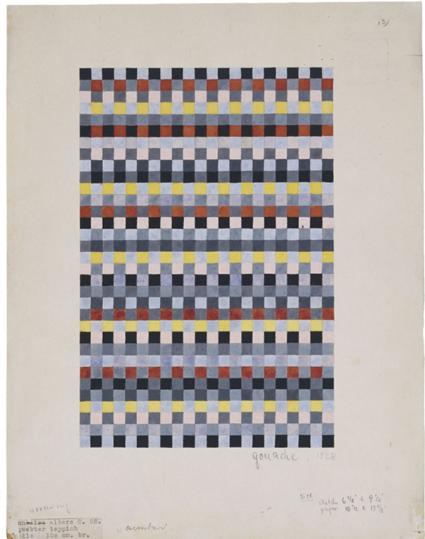
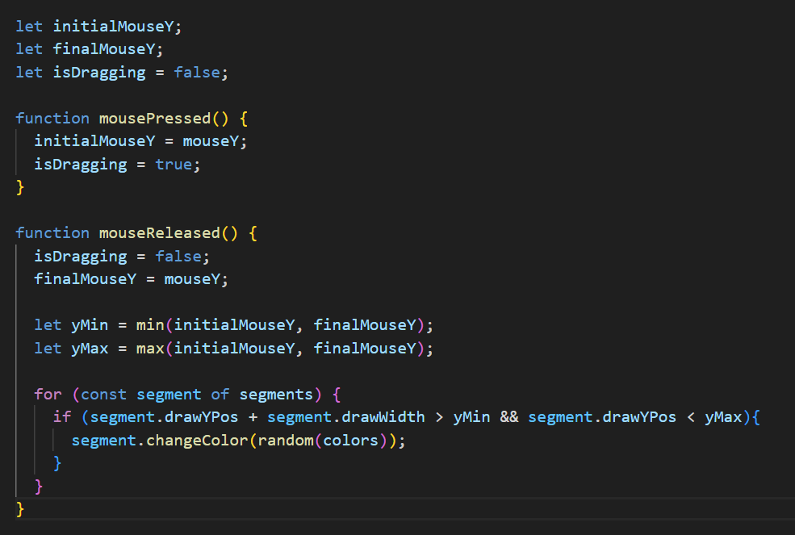

# hwei0634_9103_tut4_groupD_majorProject
## Instructions on how to interact with the work
**key press** 
Pressing the spacebar switches the canvas screen between "images" and "segments".
**mouse move** 
When the mouse moves across the canvas, a solid black line is displayed indicating the "column" position of the mouse.
**mouse drag** 
When the user clicks and drags the mouse, the columns that the mouse drag moves through will be selected, and when the mouse is released, the colors of the segments in these columns will be randomly changed again. The randomly assigned colors come from the "colors" we set.
## Details of my individual approach to animating the group code
**interaction** 
I choose interaction to drive my individual code. We animated the position of segments. I use mousePressed(), mouseReleased(), changeColor(newColor) and variable, "isDigging", to achieve the effect: drag the mouse to select a area and change the segment's color within the area.
**inspiration** 

**technical explanation** 
*let nearestRow = Math.round((mouseY - imgDrwPrps.yOffset) / (imgDrwPrps.height / numSegments));* 
*stroke(0);*
*strokeWeight(2);*
*let y = nearestRow * (imgDrwPrps.height / numSegments) + imgDrwPrps.yOffset;*
*line(imgDrwPrps.xOffset, y, imgDrwPrps.xOffset + imgDrwPrps.width, y);* 
//Calculate the closest "column" to the mouse position and draw a solid black line at that position, which will move with the mouse.

*let initialMouseY;*
*let finalMouseY;*
*let isDragging = false;*
//initialMouseY and finalMouseY record the Y position when the mouse is clicked and the Y position when the mouse is released, respectively
//isdragging will be used to determine if the mouse is dragging

*let yMin = min(initialMouseY, finalMouseY);*
*let yMax = max(initialMouseY, finalMouseY);*
//Determine the range of mouse drag movement

 *for (const segment of segments) {
    if (segment.drawYPos + segment.drawWidth > yMin && segment.drawYPos < yMax){
      segment.changeColor(random(colors));
    }
  }*
//Change the color of the selected segment.

